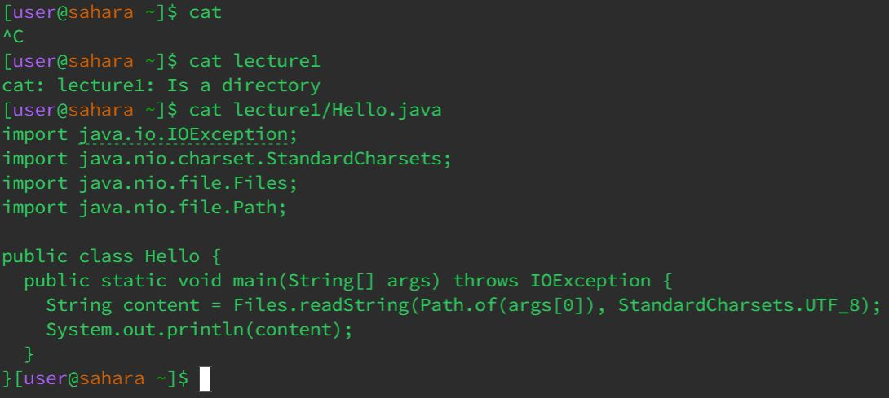

# **Lab Report 1 - Remote Access and FileSystem (Week 1)**
* **`cd`**
  * 
  * Working Directory: `/home` & `/home/lecture1`
  * With no argument I saw since being at the `/home` directory, it did nothing.
    If I had started at any other directory when strictly typing `cd`, it would've returned
    me back to the root directory. Otherwise when providing the `lecture1` parameter it changed directory
    and lastly when I tried changing to a non-directory pathway, it outputed an error. 
* **`ls`**
  * 
  * Working Directory: `/home` & `/home/lecture1`
* **`cat`**
  * 
  * Working Directory: `/home`
