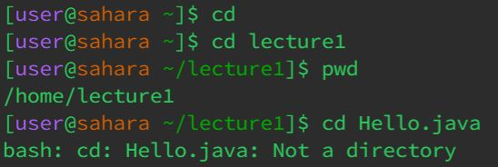

# **Lab Report 1 - Remote Access and FileSystem (Week 1)**
* **`cd`**
  * 
  * Working Directory: `/home` & `/home/lecture1`
  * With no argument I saw since being at the `/home` directory, it did nothing.
    If it were already at another 
* **`ls`**
  * 
  * Working Directory: `/home` & `/home/lecture1`
* **`cat`**
  * 
  * Working Directory: `/home`
