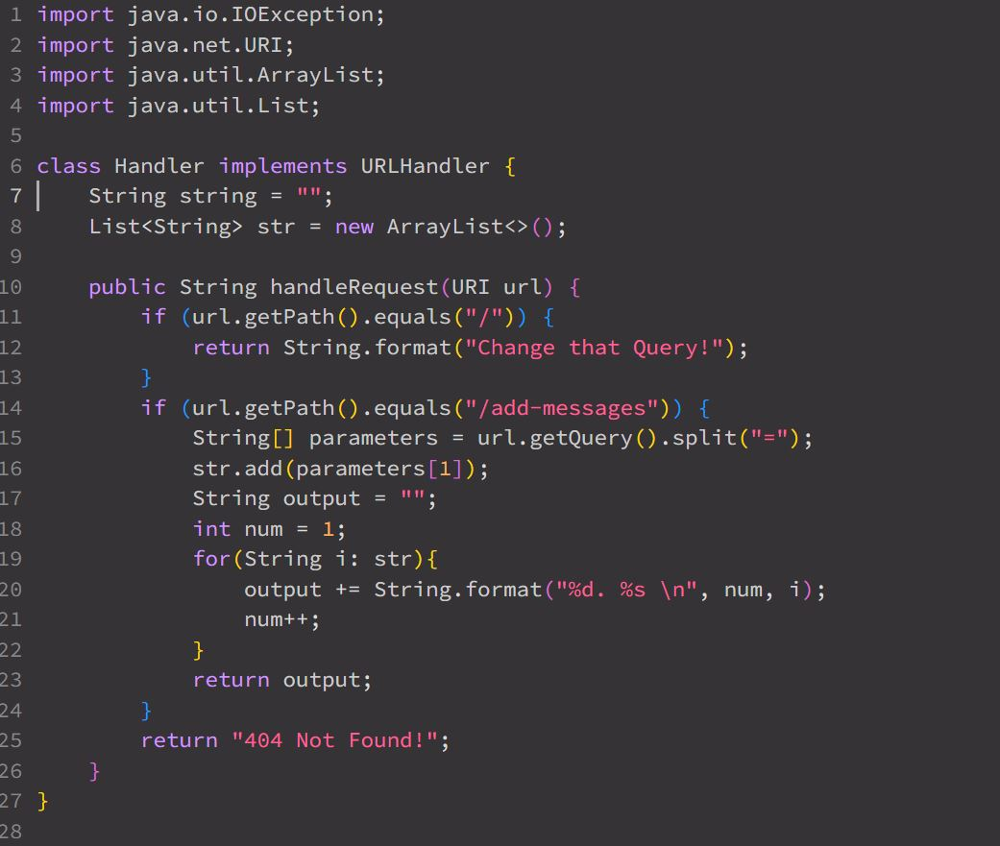
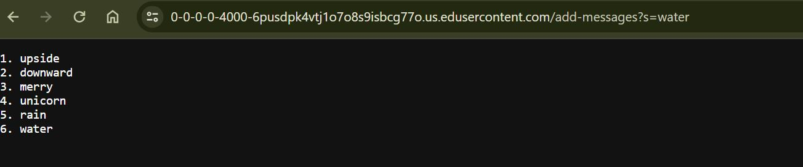
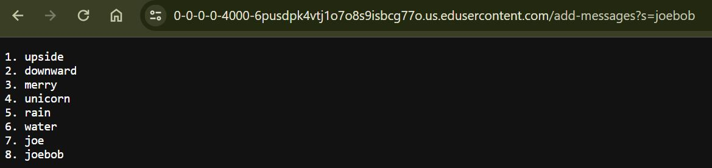
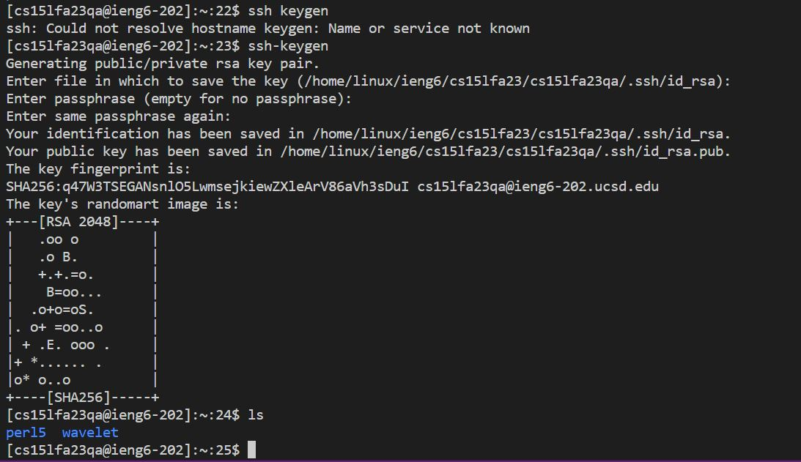
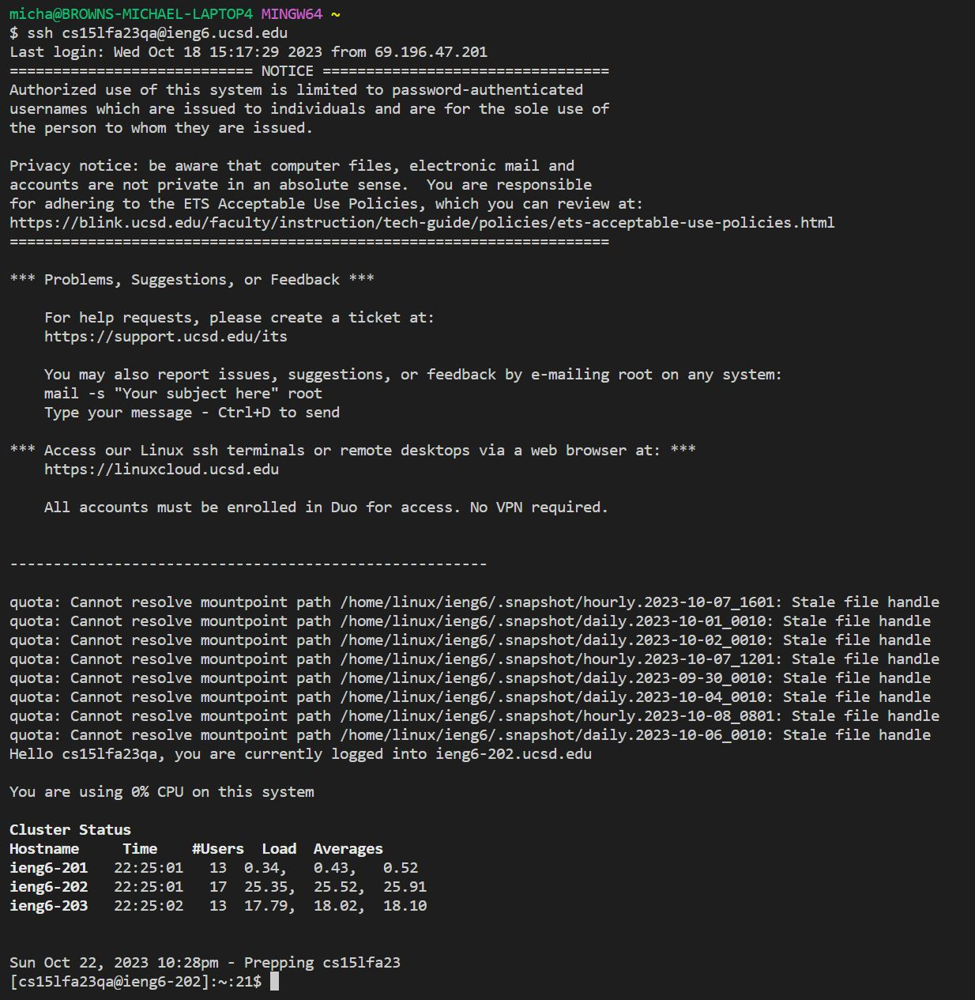
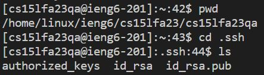

# **Lab Report 2 - Servers and SSH Keys (Week 3)**
* **Part 1**
  * 
  * 
  * 
  * For both screenshots the `handleRequest` method is being run each time. 
  * The relevant arguments are the url path, the query, and the text following the queries equal signs. The relevant fields starts with the arraylist assigned to `str` which appends each element as its added, `nums` which increments as each element is added, and the resulting `output` String that it was returned upon completion. Furthermore, the arraylist provides the servers memory, storing each input as it comes. This is used in the for loop to output everything as its given. The `output` is the empty string the changes after each for loop cycle adding each element on. Finally the `nums` inrements and provides a proper listed number each for-each loop iteration.
  * The arraylist `str`, the int `nums`, and String `output` all change. Each one changes after every input, incrementing singularly everytime. This goes for the strings added and the `nums` value. As aforementioned, each changes upon each query as well as iteration through the for-each loop.
  * Lastly in each output screen shot, we can see the difference after two new inputs have been added. This is due to the difference seen between the first screenshot and the second.
* **Part 2**
  * 
  * 
  * 
  * **Private:** `/home/linux/ieng6/cs15lfa23/cs15lfa23qa/.ssh/id_rsa`
  * **Public:** `/home/linux/ieng6/cs15lfa23/cs15lfa23qa/.ssh/id_rsa.pub`
* **Part 3**
  * Something that I enjoyed truly learning through experience with this lab was the relationship between my raw code, manually compiling it and
    testing it on my locally hosted server. Primarily it felt like my programming was actually being used for something that produced a real result
    whereas in previous CS classes we test through JUNIT or unit tests. I enjoyed learning the nuances of setting up my own server to test my code.
