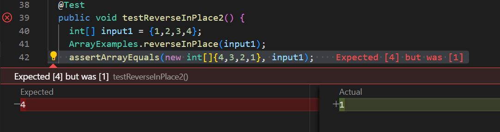
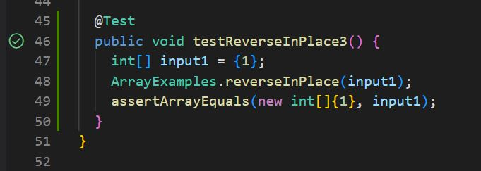

# **Lab Report 3 - Bugs and Commands (Week 5)**
* **Part 1**
  * `@Test 
	public void testReverseInPlace2() {
    int[] input1 = {1,2,3,4};
    ArrayExamples.reverseInPlace(input1);
    assertArrayEquals(new int[]{4,3,2,1}, input1);
	}`
  * `@Test 
	public void testReverseInPlace3() {
    int[] input1 = {1};
    ArrayExamples.reverseInPlace(input1);
    assertArrayEquals(new int[]{1}, input1);
	}`

  * 
  * 
    
  * **Before:**
  * `static void reverseInPlace(int[] arr) {
    for(int i = 0; i < arr.length; i += 1) {
      arr[i] = arr[arr.length - i - 1];
    }
  }`
  * **After:**
  * `static void reverseInPlace(int[] arr) {
    for(int i = 0; i < arr.length / 2; i += 1) {
      int temp  = arr[i];
      arr[i] = arr[arr.length - i - 1];
      arr[arr.length - i - 1] = temp;
    }
  }`
This fix properly addresses the issue since the method now accomplishes the desired result. The reverseInPlace() method did not properly function prior to my overhaul of it due to the inadequate calculations. Each iteration my new algorithm changes each position simultaneously.
 
* **Part 2**
  * `find`
	* *Searching by Size:*
  	* `$ find -size +1M`, this searches for files that are greater than 1MB and since none are we recieve no ouput.
   	* `$ find -size +1G`, this searches for files that are greater than 1GB and since none are we recieve no ouput.
   	* *Deleting Files*
    	*  `$ find type -f -name "find-results.txt" -exec rm {} \;`, this deletes files based on the parameters given. In this case it deleted *"find-results.txt"*.
     	* `$ find type -f -name "*.txt" -exec rm {} \;`, this deletes all files of type *".txt"* in the working directory.
      	* *Searching for Empty Folders*
      	* `$ find type -d -empty`, this seraches for empty directories, outputs nothing since there are none.
      	* `$ find type -f -empty`, this find empty files.
      	* *Search by a User on PC*
      	* `$find -user micha`, this outputed all files since they all lie within my user's directory.
      	* `$find -user tom`, this returns `find: ‘tom’ is not the name of a known user` since I am the only user of my PC.

In finding `find` command options, *ChatGPT* was used. The inputs given were *"List some usage options for the command `find`?"*.This resulted with a laundry list of ways to utilize `find`. I chose 4 and tested them on my own.
