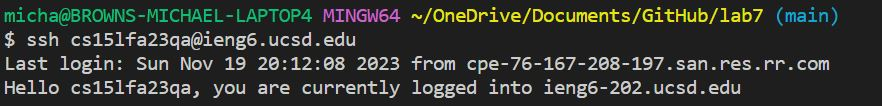
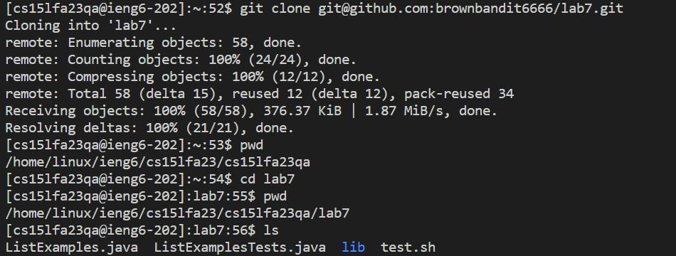
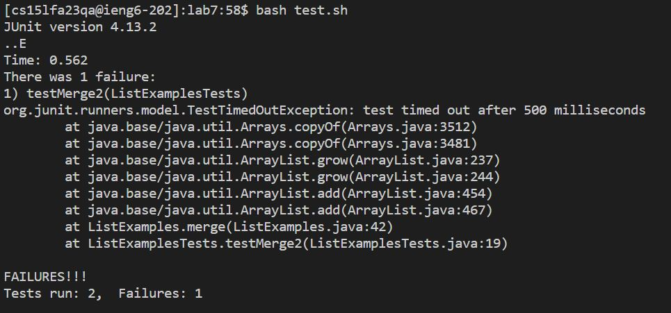
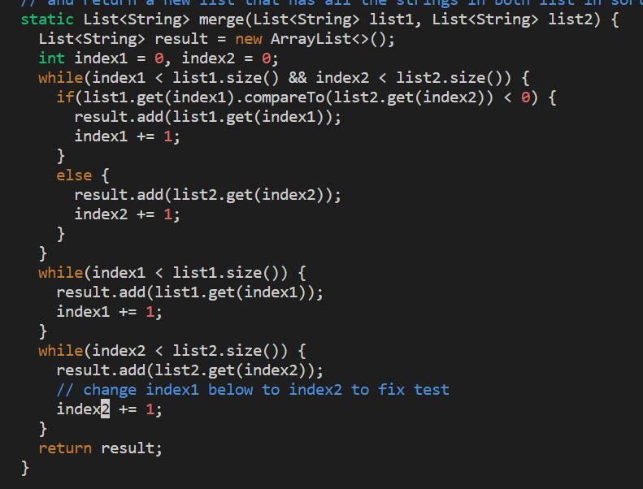
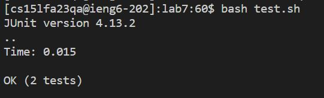
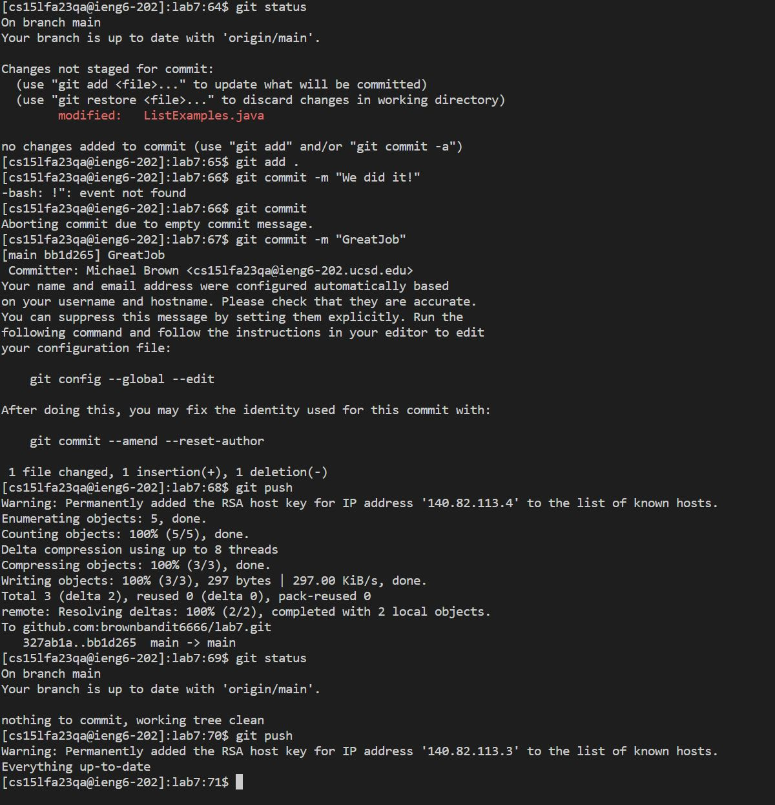

# **Lab Report 4 - Vim (Week 7)**
  * 
    * **Key Path:** `ssh cs15lfa23qa@ieng6.ucsd.edu`,  *<"enter">*
  * 
    * **Key Path:** `git clone git@github.com:brownbandit6666/lab7.git`,   *<"enter">*
  * 
    * **Key Path:** `bash test.sh`,   *<"enter">*
  * 
    * **Key Path:** `vim ListExamples.java`, *<"down">* x44,   *<"right">*x12,   *x*,    *i*,   *2*,   *<"esc">*,   *:wq*
  * 
    * **Key Path:** `bash test.sh`,   *<"enter">*
  * 
    * **Key Path:** `git status`, `git add .`, `git commit -m "GreatJob"`, `git push`, `git status`
