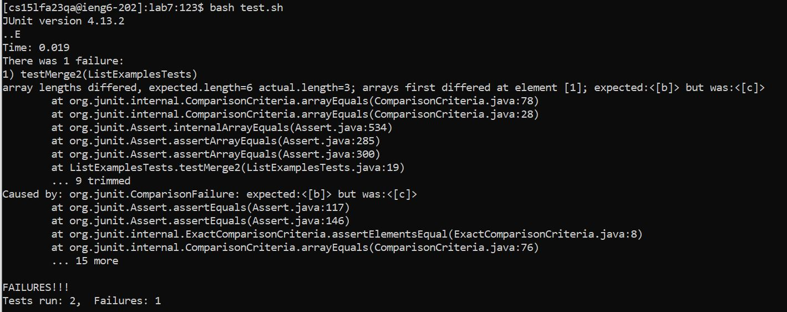
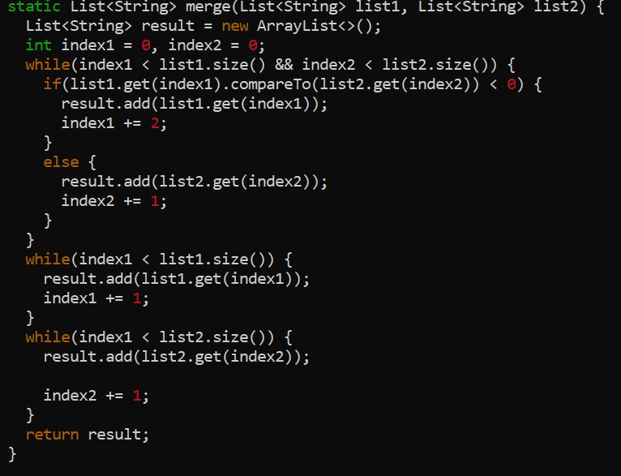
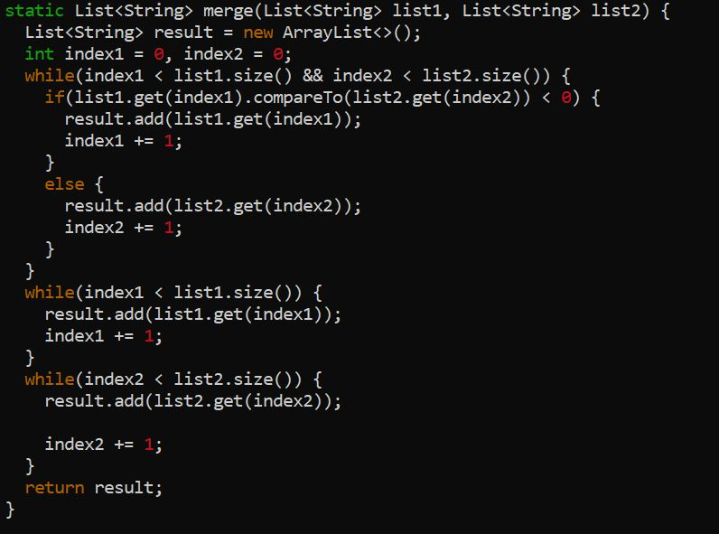
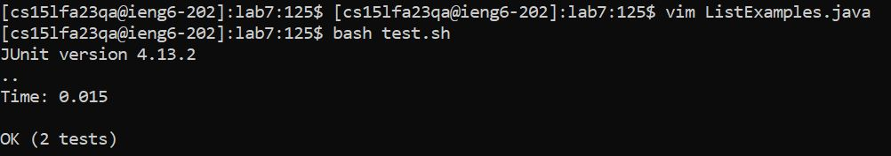
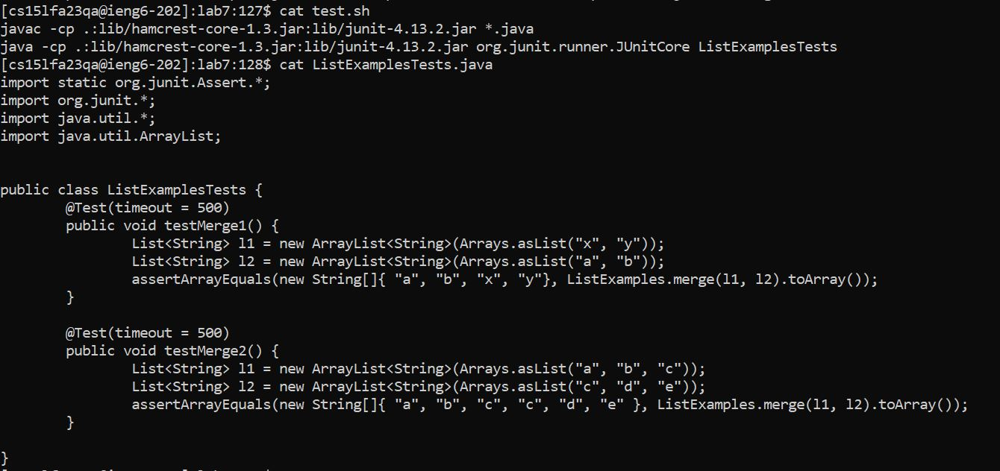

# **Lab Report 5 - Putting it All Together (Week 9)**
## Part 1 - Debugging Scenario
  1. "Hey TA, I ran into a problem when running my `ListExamples.java` file using my `test.sh` bash script. It seems like I had some sort of out of bounds error some type of bug that increments the type of length incorrectly. I currently do not have an IDE handy to make the changes, so all I'm working with is my terminal remotely connecting to my PC at home. Any ideas about how to fix this error using nothing but the terminal?" -*Michael*
    
  2. "Hey Michael, try looking back at your notes about what techniques we can use to edit files wihtin the terminal. One possibility is using Vim, for starters. As for your reported symptom, I think you've got a good idea about a possible bug so try and fix it using Vim. Also make sure to take note of the comparison inducing failure." -*TA*
  3. "Thank you for the assistance! I used Vim to view and ultimately edit my code straight from the terminal. My bug was rooted in the incrementation, it seemed to be incrementing by 2 rather than 1. Moreover thank you for making me aware about the comparison issue, it seemed I was comparing the wrong `index` values in the last `while` loop." -*Michael*
     ### **Bug:**
     
     ### **Bug Fix:**
     
     ### **Passed JUNIT Tests:**
     
### **Step 4**
* The file & directory structure needed was a `tesh.sh` file with the `set -e` notation and JUNIT commands in order to successfully run JUNIT Tests. `ListExamples.java` and `ListExamplesTests.java` files are necessary for the bug which is found in `ListExamples.java` and being able to run the tests found in `ListExamplesTests.java`. All files aforementioned can be found under a singular directory.
* The contents of each file before fixing the bug is as follows:
  
  
* The full command line I ran to trigger the bug can be simply seen from running `bash test.sh` in the command.
  
* Description of what to edit to fix the bug starts by addressing the incrementation of `index1` in the first while loop by changing it from 2 to 1 which allows for the proper incrementation and no skips or unexpected lengths. The second fix is located in the parameters of the last while loop `index1 < list2.size()` where `index1` needs to be changed to `index2` due to the nature of the comparison.

## Part 2 - Reflection
I'll speak about two different things I learned. Firstly about the techinal applications of techniques from lab, I really enjoyed learning how to almost completely traverse through my own computer strictly through the command line and gain access, remove, change, and ultimately have total free range editing power. Learning about how to edit files especially when they aren't located on your personal computer using Vim was really cool to learn. The second fun thing I learned was from my lab partner Daniel. For his intro to java class in community college, he created and designed an outer space asteroid game from scratch. It made me think of the possibilities of what I could do and I found it inspirational.
